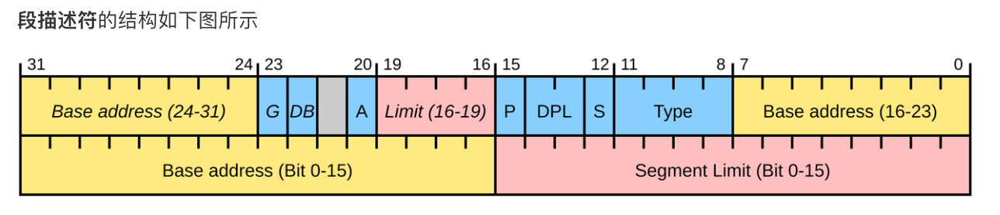

pusha顺序：eax ecx edx ebx old-esp ebp esi edi

# memory

中断描述符表（IDT）的每个表项: 8个字节组成，门描述符。可以分为 3 种：
- Interrupt Gate，跳转执行该中断对应的处理程序时，EFLAGS中的IF位会被硬件置为 0 ，即关中断，以避免嵌套中断的发生
- Trap Gate，跳转执行该中断对应的处理程序时，EFLAGS中的IF位不会置为 0 ，也就是说，不关中断
- Task Gate，Intel设计用于任务切换，现代操作系统中一般不使用


门描述符（gate descriptor）

```
                                80386 INTERRUPT GATE
31                23                15                7                 0
+-----------------+-----------------+---+---+---------+-----+-----------+
|              OFFSET 31..16        | P |DPL|0 1 1 1 0|0 0 0|(NOT USED) |4
|-----------------------------------+---+---+---------+-----+-----------|
|               SELECTOR            |            OFFSET 15..0           |0
+-----------------+-----------------+-----------------+-----------------+

                                80386 TRAP GATE
31                23                15                7                 0
+-----------------+-----------------+---+---+---------+-----+-----------+
|             OFFSET 31..16         | P |DPL|0 1 1 1 1|0 0 0|(NOT USED) |4
|-----------------------------------+---+---+---------+-----+-----------|
|               SELECTOR            |           OFFSET 15..0            |0
+-----------------+-----------------+-----------------+-----------------+
```

段描述符 SegDesc



IDT中存储门描述符，根据门描述符的选择子到gdt中查找段描述符，通过段描述符定位到代码内存位置

## TSS

借助TR（任务寄存器）和TSS（任务状态段）来确定用于保存EFLAGS，CS，EIP等寄存器信息的新堆栈。
TSS 中包含了不同特权级下的堆栈指针（SS 和 ESP），当中断发生时，CPU 会根据当前特权级从 TSS 中加载相应的堆栈指针，从而确保状态信息能够正确保存到合适的堆栈中。

TR（Task state segment Register）是 16 位的任务状态段寄存器，结构和CS这些段寄存器完全一样，它存放了GDT的一个索引，可以使用ltr指令进行加载。

通过TR可以在GDT中找到一个TSS段描述符

当发生中断并进入 ring0 特权级时，CPU 会从 TSS 中读取 SS0 和 ESP0，以进行堆栈切换。

CPL（当前特权级）与中断对应的门描述符的DPL（描述符特权级）。

硬件切换堆栈只发生在目标代码的特权级别高于当前堆栈


# 系统调用

int 0xa的行为：
- 从igdt里取出idt的地址，取出idt[a]里的门描述符
- 比较cpl、dpl，cpl必须小于等于dpl
- 若是从ring 3到ring 0，根据tr和gdt找到tss，从tss中取出ss0、esp0，将用户态数据加载到堆栈
- 将eflags、cs、eip压入堆栈
- 若门描述符是 interrupt gate，将IF清零禁用中断
- 对于某些中断向量，将error code压入堆栈
- 使用idt[a]设置cs、eip，开始执行isr
