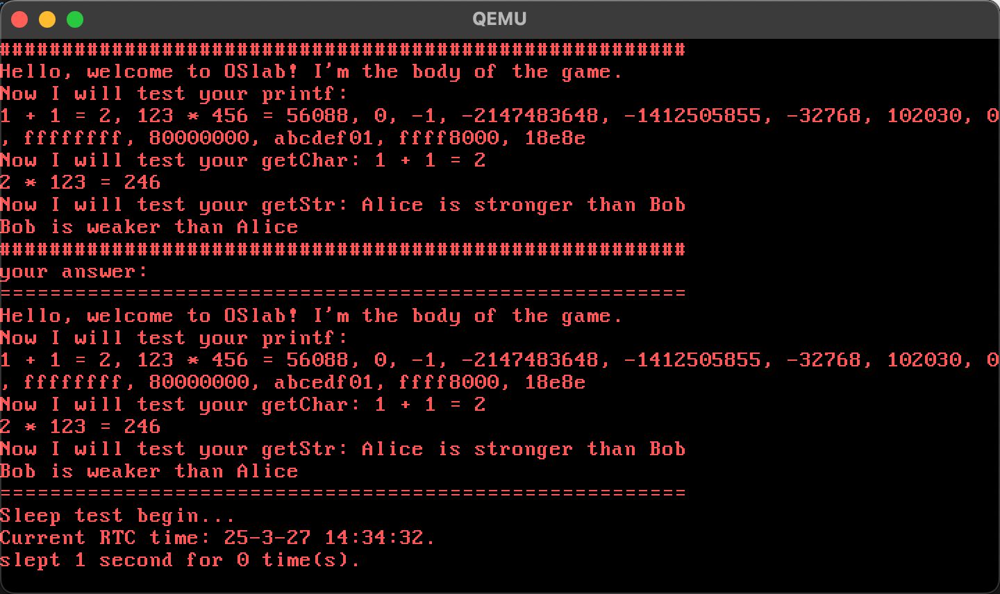
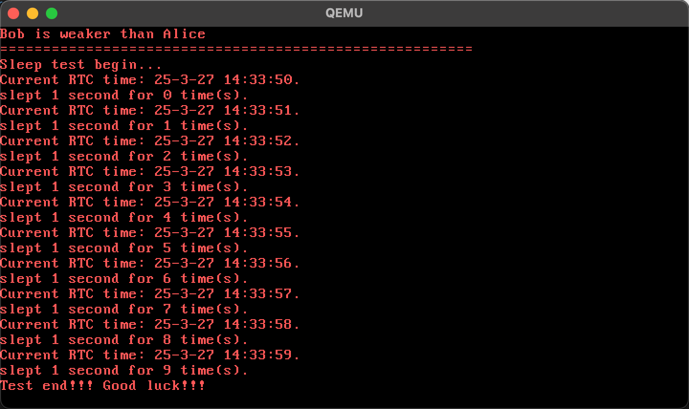

# lab2实验报告

231220087 蒋于欣 231220087@smail.nju.edu.cn

实验进度：完成了所有内容。

# 由实模式开启保护模式并跳转到bootloader

在start.s中，修改esp：

```
movl $0x7c00,%eax
```

# bootloader加载kernel

在bootMain中添加：

```c
	struct ELFHeader* elfHeader = (void*)elf;
	kMainEntry = (void(*)(void))elfHeader->entry; // 指向 ELF 文件的入口点
	phoff = elfHeader->phoff;
```

# 进入用户空间

由kerne通过loadUMain 加载用户程序：

- 读取 ELF 文件并将其内容加载到内存，从 201 号扇区开始读取
- uMainEntry = ELF 文件的入口地址
- 将 elf 地址处的数据向前移动 offset
- 切换到用户态

```c
void loadUMain(void) {
	uint32_t uMainEntry = 0x200000;
	int offset = 0x1000;
	unsigned int elf = 0x200000;

	int start = 201;
	for(int i = 0; i < 200; i++){
		readSect((void*)(elf + i*512), start + i); 
	}

	struct ELFHeader* elfHeader = (void*)elf;
	uMainEntry = (uint32_t)(elfHeader->entry);

	for(int i  = 0; i < 200 * 512; i++){
		*(uint8_t*)(elf + i) = *(uint8_t*)(elf + i + offset);
	}
	enterUserSpace(uMainEntry);
}
```

在kEntry中，进行一系列初始化。

# 中断机制

调用链：irqSyscall -> asmDoIrq -> irqHandle -> 具体的中断处理函数

## idt.c

初始化interrupt gate。trap gate类似

```c
static void setIntr(struct GateDescriptor *ptr, uint32_t selector, uint32_t offset, uint32_t dpl) {
	ptr->offset_15_0 = offset;
	ptr->offset_31_16 = offset >> 16;
	ptr->segment = selector;
	ptr->type = 0xe; // 01110
	ptr->privilege_level = dpl;
	ptr->present = 1;
}
```

在initIdt中，将函数写到对应向量号的idt表中，并填上段选择子 `SEG_KCODE`：

```c
	setTrap(idt + 0x1e, SEG_KCODE, (uint32_t)irqSecException, DPL_KERN);
```

IDT（中断描述符表，Interrupt Descriptor Table）：在保护模式下，每个中断或异常都有一个特定的入口，IDT 负责将这些入口地址存储并管理。

IVT（Interrupt Vector Table）：在实模式（Real Mode）下，固定在 0x0000-0x03FF地址。

IDT 提供 DPL控制，防止低权限代码访问高权限中断，且可选中断门、陷阱门来更精细地控制执行流，而IVT无法提供。

IDT可以将用户与内核区分开，也可以让用户自行定义中断处理函数，实现对内核资源的访问。提供了安全性与灵活性。

TSS：记录了与任务相关的所有关键状态信息的结构体。包括：

- 特权级 0 的栈段选择子
- 上一个 TSS 的选择子
- 特权级 0 的栈指针
- 特权级1、2的栈段选择子、栈指针
- 页目录基址、eip、EFLAGS、通用寄存器、段寄存器、LDT选择子

TSS 主要用于任务切换时保存与恢复任务状态、特权级切换。确保了系统安全。

在中断异常中，TSS作用如下：
- 当从用户模式切换到内核模式时，通过 TSS 中的 esp0、ss0 切换到内核栈

TSS中没有ring3的堆栈信息，是因为 Ring 3 -> Ring 0 切换时需要更换堆栈，而 Ring 0 -> Ring 3 切换是一个特权级降低的过程，直接通过iret等指令来切换，不需要通过TSS更换堆栈。

# 实现系统调用

## KeyboardHandle

辅助函数print_out：
```c
void print_out(int displayRow, int displayCol, char character){
	int vga_mem = 0xB8000; // VGA 显存起始地址
	int color = 0x0c;
	int pos = (displayRow * 80 + displayCol) * 2;
	*(char*)(vga_mem + pos) = character;
	*(char*)(vga_mem + pos + 1) = color;
}
```

将用户输入的字符存入键盘缓冲区并打印到屏幕。

```c
    keyBuffer[bufferTail++] = ch;
    asm volatile("movw %0, %%es"::"m"(sel)); // 将 sel 的值加载到段寄存器 ES 中。
    print_out(displayRow, displayCol, ch);
```

## syscall

参数从左到右，依次放入：eax ecx edx ebx esi edi。用int $0x80陷入中断。并以eax作为返回值。

## print

调用链：printf `syscall.c` -> syscall(`int $0x80`) -> irqHandle -> syscallHandle -> sysPrint `iqrhandle.c`

printf实现：
- 设置paraList指针指向第一个可变参数的位置
- 遍历字符串：
  - 在3种状态中切换，0表示%，1表示format，2表示普通字符
  - 对于四种format，应用已有的宏定义和转换函数
  - 如果buffer已满，就系统调用打印出buffer中的内容

```c
while(format[i]!=0){
    // TODO: support format %d %x %s %c
    char ch = format[i++];

    switch(state) {
        case 0:
            if (ch == '%') state = 1;
            else buffer[count++] = ch;
            break;
        case 1:
            if (ch == 'd') {
                count = dec2Str(va_arg(paraList, int), 
                buffer, MAX_BUFFER_SIZE, count);
            }
            else if (ch == 'x') {
                count = hex2Str(va_arg(paraList, uint32_t), 
                buffer, MAX_BUFFER_SIZE, count);
            }
            else if (ch == 's') {
                count = str2Str(va_arg(paraList, char *), 
                buffer, MAX_BUFFER_SIZE, count);
            }
            else if (ch == 'c') {
                buffer[count++] = va_arg(paraList, char);
                if (count == MAX_BUFFER_SIZE) {
                    syscall(SYS_WRITE, STD_OUT, 
                    (uint32_t)buffer, (uint32_t)count, 0, 0);
                    count = 0;
                }
            }
            else {
                state = 2;
                return;
            }
            state = 0;
            break;
        case 2: return;
        default: break;
    }
}
```

### sysprint

- 通过displayRow、displayCol两个变量维护光标位置
- 打印到显存，也就是将字符写入显存的地址
- 实现换行、清屏

```c
for (i = 0; i < size; i++) {
    // 从 ES 段中以 str + i 作为偏移地址，读取 1 个字节，并将其存入 character。
    asm volatile("movb %%es:(%1), %0":"=r"(character):"r"(str+i));
    // TODO: 完成光标的维护和打印到显存
    if(character == '\n'){
        displayCol = 0;
        displayRow++;
    }
    else{
        print_out(displayRow, displayCol, character);
        displayCol++;
    }
    // 换行
    if(displayCol >= 80){
        displayRow++;
        displayCol = 0;
    }
    // 滚屏
    if(displayRow >= 25){
        scrollScreen();
        displayRow--;
        displayCol = 0;
    }
}
```

## GetChar

调用链：getChar -> syscall -> irqHandle -> syscallHandle -> sysGetChar

getChar：系统调用读入字符

```c
char getChar(){ // 对应SYS_READ STD_IN
	char ret = 0;
	ret = (char)syscall(SYS_READ, STD_IN, 0, 0, 0, 0);
	return ret;
}
```

sysGetChar：

- 通过阻塞方式，等待输入结束
- 返回键盘缓冲区中的第一个字符
- 清除已读取的数据

```c
void sysGetChar(struct TrapFrame *tf){
	// TODO: 自由实现
 	wait_for_input();
	tf->eax = keyBuffer[bufferHead++];
	bufferHead = bufferTail;
}
```

## GetStr

GetStr：系统调用读入字符串

```c
void getStr(char *str, int size){ // 对应SYS_READ STD_STR
	syscall(SYS_READ, STD_STR, (uint32_t)str, (uint32_t)size, 0, 0);
	return;
}
```

sysGetStr：

- 通过阻塞方式，等待输入结束
- 读取键盘缓冲区到用户缓冲区，遇到换行符/到达最大读取字符数/到达缓冲区尾部停止
- 在用户缓冲区末尾加上 `\0`
- 清除已读取的数据

```c
void sysGetStr(struct TrapFrame *tf){
	int sel = USEL(SEG_UDATA);
	char* str = (char*)tf->edx; // 用户缓冲区地址
	int size = tf->ebx; // 最大读取字符数
	asm volatile("movw %0, %%es"::"m"(sel));
 	wait_for_input();
	int i = 0;
	while(bufferHead < bufferTail && keyBuffer[bufferHead] != '\n' && i < size){
		if(keyBuffer[bufferHead] != 0) asm volatile("movl %0, %%es:(%1)"::"r"(keyBuffer[bufferHead]), "r"(str + i));
		i++;
		bufferHead++;
	}
	asm volatile("movb $0x00, %%es:(%0)"::"r"(str+size));
	bufferHead = bufferTail;
	tf->eax = size;
}
```

## now

调用链：now -> syscall -> int $0x80 -> irqHandle -> syscallHandle -> sysNow

使用RTC(real time clock)方式实现now函数：

- 通过系统调用，读取RTC寄存器
- 将bcd格式转换为数字格式

```c
void now(struct TimeInfo *tm_info) {
	tm_info->second = bcd_to_int(syscall(SYS_NOW, 0x00, 0, 0, 0, 0));
	tm_info->minute = bcd_to_int(syscall(SYS_NOW, 0x02, 0, 0, 0, 0));
	tm_info->hour = bcd_to_int(syscall(SYS_NOW, 0x04, 0, 0, 0, 0));
	tm_info->m_day = bcd_to_int(syscall(SYS_NOW, 0x07, 0, 0, 0, 0));
	tm_info->month = bcd_to_int(syscall(SYS_NOW, 0x08, 0, 0, 0, 0));
	tm_info->year = bcd_to_int(syscall(SYS_NOW, 0x09, 0, 0, 0, 0));
}
```

在`lib.h`中，定义：
```c
#define SYS_NOW 2 
```

在syscallHandle中添加：
```c
  case 2: sysNow(tf);
```

sysNow:
- 通过直接访问RTC寄存器来获取当前的时间信息。
- 通过存放在ecx中的编号，读取对应的时间类型，返回时间
```c
void sysNow(struct TrapFrame *tf){
	int reg = tf->ecx;
	short port = 0x70;
	outByte(port, reg); // 向端口 0x70 写入偏移量
	port = 0x71;
	uint8_t data = inByte(port); // 从端口 0x71 读取数据
	tf->eax = data;
}
```

## sleep

在start.s中，仿照lab1，添加8253定时器设置，产生20 毫秒的时钟中断。

定时器中断：

- 中断号0x20
- 设置IDT，绑定0x20与对应的处理程序 `irqTimer`。

```c
setIntr(idt + 0x20, SEG_KCODE, (uint32_t)irqTimer, DPL_KERN);
```

- 在irqHandle中添加：

```c
case 0x20: // irqTimer
		timerHandler(tf);break;
```

实现sleep库函数：

- 用一个标志timer_flag来表示是否处于sleep状态，用计数器timer_cnt来计时，到达时间后解除sleep状态
- `syscallHandle`中添加两个辅助函数sysSetTimeFlag、sysGetTimeFlag
- 在timerHandler中用计数器timer_cnt来计时

```c
void sleep(unsigned int seconds) {
    syscall(SYS_SET_TIME_FLAG, 0, 0, 0, 0, 0);
	uint32_t tm = 0;

	while(1){
		tm = syscall(SYS_GET_TIME_FLAG, 0, 0, 0, 0, 0);

		if(tm >= seconds * 50) {
			syscall(SYS_SET_TIME_FLAG, 0, 0, 0, 0, 0);
			return;
		}
	}
}

void timerHandler(struct TrapFrame *tf) {
	if(timer_flag == 1) timer_cnt++;
	else timer_cnt = 0;
}
void sysSetTimeFlag(struct TrapFrame *tf) {
	if(tf->ecx == 1) {
		timer_flag = 1;
		timer_cnt = 0;
	}
	else timer_flag = 0;
}

void sysGetTimeFlag(struct TrapFrame *tf) {
	tf->eax = timer_cnt;
}
```

# debug

在加载kernel、用户程序并进入用户空间时，出现显示错误，检查代码发现，是在初始化陷阱门时，没有将段描述符的索引值转换为实际的段选择子。
`ptr->segment = KSEL(selector);  `

# 实验结果




